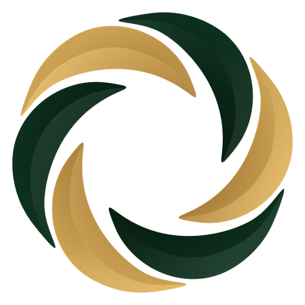

<div align="center">

  

  # SKALORIX

  **Scale Beyond Limits — Ideas Into Impact**

  *A high-performance editorial digital experience combining strategy, creative design, 3D WebGL engineering, and modern web technologies.*

  <br />

  [](https://react.dev/)
  [](https://vite.dev/)
  [](https://threejs.org/)
  [](https://gsap.com/)
  [](https://workers.cloudflare.com/)
  [](LICENSE)

  <br />

  [Explore Live Demo](https://skalorix.pages.dev) • [Our Services](#-core-services) • [Case Study](#-flagship-case-study-snpit) • [Getting Started](#-getting-started) • [Contact](#-contact--inquiries)

</div>

---

## ✦ Brand Vision & Philosophy

**SKALORIX** is a full-spectrum digital agency and technology studio. We bridge the gap between creative marketing strategy and cutting-edge software engineering. 

We believe that true brand growth requires both **artistic distinction** and **technical superiority** — building digital products that captivate users visually while performing at enterprise scale.

- **Tagline**: *"Scale Beyond Limits"*
- **Motto**: *"Ideas Into Impact"*
- **Design Philosophy**: Editorial, architectural, cinematic, and responsive.
- **Brand Identity**: Features the custom 6-blade aperture swirl emblem — a geometric vortex uniting deep forest emerald and brushed ochre gold in perpetual radial motion.

---

## ⚡ Key Highlights & Experience

### 1. Interactive 3D WebGL Canvas
- **PBR Hero Sculpture**: Custom 3D ribbon sculpture rendered using Three.js and React Three Fiber (`@react-three/fiber`, `@react-three/drei`), complete with physical roughness, metalness, and normal map displacement.
- **Digital Constellation**: Interactive multi-node ecosystem constellation with particle vortexes, orbital rings, and dynamic pointer interaction.

### 2. Kinetic Motion Choreography
- **GSAP & ScrollTrigger**: Precise scroll-linked timelines, letter-by-letter text reveals, counter increments, and fluid page transitions.
- **Lenis Smooth Inertia**: Physics-driven inertial scrolling synchronized with the browser refresh cycle for a native luxury feel.

### 3. Signature Design System
- **Duality Palette**: Seamless transitions between Dark Mode (`#070A08` / `#1B2E24`) and Editorial Light Parchment (`#F8F4EA`).
- **Precision Typography**: Harmonious pairing of high-contrast serif (*Playfair Display*, *Cormorant Garamond*) with modern geometric sans-serif (*Plus Jakarta Sans*, *Inter*).
- **Interactive Cursor**: Custom physics-based magnetic cursor with dynamic blend-mode inversion across headings, buttons, and media cards.

---

## 🛠 Core Services

| Service | Focus Areas | Business Impact |
| :--- | :--- | :--- |
| **Search Engine Optimization (SEO)** | Technical SEO audits, content clustering, keyword intelligence, Core Web Vitals optimization | High-intent organic traffic growth and sustainable domain authority. |
| **Creative & Brand Identity** | Brand architecture, editorial typography, visual guidelines, 3D assets, motion design | Unforgettable brand positioning that commands premium market value. |
| **Social Media Management (SMM)** | Content calendar curation, community engagement, brand voice consistency, social audits | Cultivates loyal community following and daily brand engagement. |
| **Social Media Marketing** | Paid audience targeting, multi-platform ad spend optimization, ROAS analytics | Scalable customer acquisition through high-converting creative funnels. |
| **Website Development** | Headless architectures, responsive layouts, 3D WebGL integration, interactive micro-animations | Lightning-fast load times, seamless responsiveness, and high conversion rates. |
| **Software Development** | Custom web apps, scalable backend APIs, Cloudflare Workers, microservices, cloud deployments | Robust, enterprise-grade digital infrastructure built to scale. |

---

## 📱 Flagship Case Study: SNPIT

The platform highlights the official case study for **SNPIT** — a production-scale Web3 camera & social lifestyle Android application:

- **250,000+ Active Users**: Global cross-platform adoption.
- **4.8★ Play Store Rating**: High community satisfaction and viral engagement.
- **99.9% Crash-Free Rate**: Resilient client-side architecture and cloud infrastructure.

---

## 💻 Technology Stack

### Core Frameworks & Libraries
```
├── React 19           # Next-generation UI runtime
├── Vite 8             # Blazing fast Rolldown-powered build tool
├── Three.js           # Low-level 3D WebGL rendering engine
├── React Three Fiber  # Declarative 3D component model
├── @react-three/drei  # Production shaders, cameras, and helpers
├── GSAP 3.14          # Industrial-strength animation & ScrollTrigger
├── Lenis 1.3          # Fluid smooth scrolling engine
├── Lucide React       # Clean, modern iconography
└── Canvas Confetti    # Celebratory interaction triggers
```

### Styling & Design System
- **100% Native Modern CSS**: Zero bloated CSS frameworks. Clean CSS custom properties (`var(--...)`), fluid typography (`clamp()`), backdrop filters, and glassmorphism.
- **True Alpha 3D Assets**: 512×512 and 256×256 vector-smoothed brand icons with zero edge-fringe or matte contamination.

---

## 📂 Project Structure

```
Skalorix/
├── public/                     # Static assets & public distribution
│   ├── assets/                 # 3D normal, metalness & symbol textures
│   ├── skalorix-o-512.png      # 512x512 high-res brand aperture emblem
│   ├── skalorix-o-256.png      # 256x256 brand aperture emblem
│   ├── favicon.svg             # Vector brand favicon
│   └── icons.svg               # SVG sprite definitions
├── src/
│   ├── assets/                 # Bundled visual assets & brand marks
│   ├── components/
│   │   ├── three/              # 3D WebGL Canvas components
│   │   │   ├── HeroSculpture.jsx     # 3D interactive hero sculpture
│   │   │   ├── OrbitalEcosystem.jsx  # 3D constellation ecosystem
│   │   │   └── Particles.jsx         # Ambient 3D particle dust
│   │   ├── sections/           # Modular page sections
│   │   │   ├── WhatWeDo.jsx          # Numbered core services overview
│   │   │   ├── WhySkalorix.jsx       # 4 core pillars & differentiators
│   │   │   ├── OurApproach.jsx       # 5-stage production methodology
│   │   │   ├── DigitalExperience.jsx # Interactive 3D ecosystem preview
│   │   │   ├── ServicesDetail.jsx    # Comprehensive service deep-dive
│   │   │   ├── SelectedWork.jsx      # SNPIT Android App case study
│   │   │   ├── CTASection.jsx        # Project inquiry & contact form
│   │   │   └── Footer.jsx            # Brand links, socials, & legal
│   │   ├── ui/                 # Reusable micro-components
│   │   │   ├── SkalorixLogo.jsx      # SVG wordmark with integrated swirl 'O'
│   │   │   ├── Button.jsx            # Metallic ochre & primary buttons
│   │   │   ├── AnimatedText.jsx      # Scroll-triggered text reveal
│   │   │   ├── GrainOverlay.jsx      # Editorial film grain texture
│   │   │   └── SectionLabel.jsx      # Monospace section category tags
│   │   ├── CustomCursor.jsx    # Fluid blend-mode magnetic cursor
│   │   ├── Navigation.jsx      # Responsive frosted-glass navbar
│   │   ├── LoadingScreen.jsx   # Orchestrated brand introduction
│   │   └── Hero.jsx            # Editorial headline, metrics, & 3D canvas
│   ├── contexts/
│   │   └── CursorContext.jsx   # Global cursor interaction state
│   ├── hooks/
│   │   ├── useLenis.js         # Smooth scrolling lifecycle hook
│   │   ├── useMediaQuery.js    # Adaptive viewport listener
│   │   └── useScrollAnimation.js # GSAP scroll intersection observer
│   ├── styles/
│   │   ├── index.css           # Design tokens, resets, typography, root variables
│   │   └── components.css      # Component layouts, forms, and responsive grid
│   └── utils/
│       ├── constants.js        # Brand content, navigation, services data
│       └── animations.js       # GSAP easing curves & motion presets
├── index.html                  # HTML5 entry with metadata & font preconnects
├── vite.config.js              # Vite 8 config with rolldownOptions chunking
└── package.json                # Project dependencies & build scripts
```

---

## 🚀 Getting Started

### Prerequisites
- **Node.js**: v18.0.0 or higher (v20+ recommended)
- **npm**: v9.0.0 or higher

### 1. Clone the Repository
```bash
git clone https://github.com/adityavani07/Skalorix.git
cd Skalorix
```

### 2. Install Dependencies
> **Note**: A `.npmrc` file is included with `legacy-peer-deps=true` to ensure seamless peer-resolution between React 19 and 3D graphics libraries.
```bash
npm install
```

### 3. Start Local Development Server
```bash
npm run dev
```
Open [http://localhost:5173](http://localhost:5173) in your browser.

### 4. Build for Production
```bash
npm run build
```
Generates an optimized, minified production bundle in the `dist/` directory with automatic code splitting for Three.js, GSAP, and core vendor chunks.

### 5. Preview Production Build
```bash
npm run preview
```

---

## 🌐 Deployment

### Deploying to Cloudflare (Workers / Pages)

Skalorix is optimized out-of-the-box for **Cloudflare Workers & Static Assets**:

- **Framework preset**: `None` / `Vite`
- **Build command**: `npm run build`
- **Build output directory**: `dist`
- **Root directory**: `/`
- **Environment variables**: None required for static build

```bash
# Optional direct CLI deployment via Wrangler
npx wrangler deploy
```

---

## 🎨 Brand Design Tokens

| Token Name | Hex Value | Preview | Description |
| :--- | :--- | :---: | :--- |
| `--deep-forest` | `#1B2E24` | `■` | Primary brand deep emerald |
| `--dark-bg` | `#070A08` | `■` | Void black surface background |
| `--soft-ochre` | `#D4B483` | `■` | Luxury brushed gold highlight |
| `--gold-accent` | `#C89B3C` | `■` | Metallic brass button & border accent |
| `--parchment` | `#F8F4EA` | `■` | Light editorial contrast surface |
| `--stone` | `#A69E93` | `■` | Warm neutral body and subtitle text |
| `--charcoal` | `#2E2E2E` | `■` | Muted dark UI accents & card borders |

---

## ✉️ Contact & Inquiries

Ready to scale your digital presence? Reach out to the SKALORIX team:

- **Official Website**: [skalorix.com](https://skalorix.com)
- **Direct Email**: [skalorix.work@gmail.com](mailto:skalorix.work@gmail.com)
- **Phone**: [+91 94094 24528](tel:+919409424528)
- **Phone**: [+91 94094 10260](tel:+919409410260)
- **GitHub**: [@adityavani07](https://github.com/adityavani07)

---

<div align="center">
  <small>© 2026 SKALORIX. All rights reserved. Crafted with precision, creativity, and modern engineering.</small>
</div>
